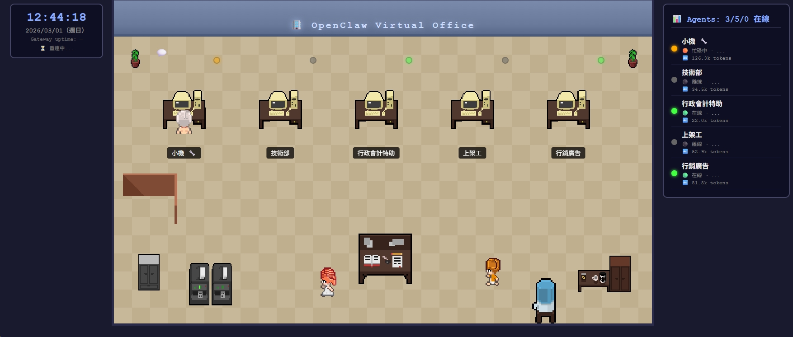

# 🏢 OpenClaw Virtual Office

[📖 繁體中文說明](README.zh-TW.md)

A pixel-art virtual office dashboard that visualizes your [OpenClaw](https://github.com/openclaw/openclaw) agent sessions in real-time.



## Concept

**One Bot, Multiple Group Chats = Virtual Office Workers**

This project is designed for teams using **Lark (Larksuite) / Feishu** with OpenClaw:

- You run **1 OpenClaw Gateway** connected to your messaging platform (Lark, Telegram, Discord, Slack, etc.)
- Each **group chat** is a separate session — a virtual "office worker" with a specific role
- Real team members join these groups to collaborate with AI agents
- This dashboard shows all agents' status at a glance, like a virtual office floor plan

### Example Setup (Lark)

```
┌─────────────────────────────────────────────────┐
│  OpenClaw Gateway (1 instance)                  │
│                                                 │
│  Lark Group: 主控室     → Session: 小機 (Admin) │
│  Lark Group: 技術部     → Session: Tech Support  │
│  Lark Group: 行政會計   → Session: Admin/Finance │
│  Lark Group: 上架工     → Session: Product Ops   │
│  Lark Group: 行銷廣告   → Session: Marketing     │
└─────────────────────────────────────────────────┘
```

Each group = one desk in the virtual office. The dashboard shows who's busy, idle, or offline.

### Other Channels

This works with **any** OpenClaw-supported channel, not just Lark:

| Channel | Session Mapping |
|---------|----------------|
| **Lark / Feishu** | 1 group chat = 1 agent (recommended: multi-user + 1 bot per group) |
| **Telegram** | 1 group or 1 DM = 1 agent |
| **Discord** | 1 channel or 1 thread = 1 agent |
| **Slack** | 1 channel = 1 agent |
| **Signal / WhatsApp** | 1 group = 1 agent |

The key idea: **each session maps to a desk in the virtual office**. Configure `config.json` to match your session keys.

## Features

- 🎨 **Pixel art office** — retro RPG-style 2D top-down view
- 📊 **Real-time status** — busy / online / idle / offline per agent
- 💬 **Activity bubbles** — floating chat indicators for busy agents
- 🚶 **Walking animation** — idle agents wander around the office
- 🔄 **Auto-refresh** — polls `status.json` every 30 seconds
- 📱 **Responsive** — works on desktop and mobile browsers
- ⚙️ **Configurable** — edit `config.json` to add/rename agents and assign sprites

## Quick Start

### Prerequisites

- [OpenClaw](https://github.com/openclaw/openclaw) gateway running with at least one channel configured
- Python 3.8+ (for the status refresh script)
- Any HTTP server (Python's built-in works fine)

### 1. Clone

```bash
git clone https://github.com/thx0701/openclaw-virtual-office.git
cd openclaw-virtual-office
```

### 2. Configure Agents

Edit `config.json` to match your OpenClaw sessions:

```json
{
  "title": "My Virtual Office",
  "refreshInterval": 30,
  "agents": [
    {
      "id": "main",
      "name": "Alice 🤖",
      "sprite": "boss.png",
      "sessionMatch": "your_chat_id_or_keyword",
      "role": "Team Lead"
    }
  ]
}
```

- **`sessionMatch`**: A substring to match against OpenClaw session keys. For Lark groups, use the group chat ID (e.g., `oc_xxxx`). For other channels, use any unique part of the session key.
- **`sprite`**: Choose from available sprites in `assets/office/` (boss.png, worker1.png, worker2.png, worker4.png, desk-with-pc.png)

### 3. Start the Status Refresher

```bash
# Run once:
python3 refresh-status.py

# Or run continuously (recommended):
python3 refresh-status.py --loop 30
```

This calls `openclaw sessions list --json` and writes `status.json`.

### 4. Serve the Dashboard

```bash
python3 -m http.server 18899 --bind 0.0.0.0
```

Open `http://localhost:18899` in your browser.

### 5. (Optional) Run Both in Background

```bash
# Start refresher
nohup python3 refresh-status.py --loop 30 > /tmp/office-refresh.log 2>&1 &

# Start web server
nohup python3 -m http.server 18899 --bind 0.0.0.0 > /tmp/office-server.log 2>&1 &
```

## Status Logic

| Status | Condition | Visual |
|--------|-----------|--------|
| 🟠 Busy | Last activity < 2 min ago | Agent at desk + 💬 bubble |
| 🟢 Online | Last activity 2–10 min ago | Agent at desk |
| 🔵 Idle | Last activity 10–60 min ago | Agent at desk (dimmed) |
| ⚫ Offline | No activity > 60 min or no session | Empty desk |

## Available Sprites

| Sprite | File | Description |
|--------|------|-------------|
| Boss | `boss.png` | Dark-haired person at desk |
| Worker 1 | `worker1.png` | Short-haired person at desk |
| Worker 2 | `worker2.png` | Blonde person at desk |
| Worker 4 | `worker4.png` | Blue-haired person at desk |
| Empty Desk | `desk-with-pc.png` | Unoccupied workstation |
| Julia (walk) | `Julia_walk_*.png` | Walking animation sprites |

## Project Structure

```
openclaw-virtual-office/
├── index.html           # Main dashboard page
├── config.json          # Agent configuration (edit this!)
├── refresh-status.py    # OpenClaw session poller
├── status.json          # Auto-generated status data
├── assets/office/       # Pixel art sprites
│   ├── boss.png
│   ├── worker1.png, worker2.png, worker4.png
│   ├── desk-with-pc.png, desk.png
│   ├── Julia_walk_*.png (walking animations)
│   ├── plant.png, coffee-maker.png, printer.png
│   ├── cabinet.png, water-cooler.png, Trash.png
│   └── office-partitions-*.png
├── screenshot.png       # For README
└── README.md
```

## Credits

- **Office pixel art**: [Free Office Pixel Art by Arlan_TR](https://arlantr.itch.io/free-office-pixel-art) (free for personal & commercial use)
- **OpenClaw**: [github.com/openclaw/openclaw](https://github.com/openclaw/openclaw)
- Built with ❤️ by the OSSLab team

## License

MIT
